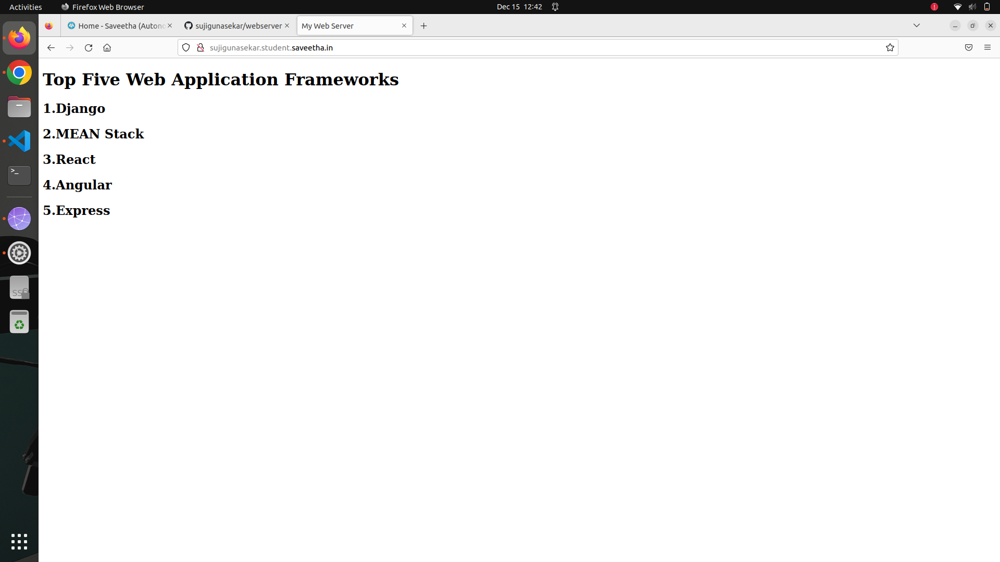

# Developing a Simple Webserver

# AIM:

To develop a webserver to display top five web application frameworks

## DESIGN STEPS:

### Step 1:

HTML content creation is done

### Step 2:

Design of webserver workflow

### Step 3:

Implementation using Python code

### Step 4:

Serving the HTML pages.

### Step 5:

Testing the webserver

## PROGRAM:
```
content ="""
<html>
<body>
<h1>Top five application frameworks</h1>
<h2>1.Django</h2>
<h2>2.MEAN Stack</h2>
<h2>3.React</h2>
<h2>4.Angular</h2>
<h2>5.Express</h2>
</body>
</html>


class WebHandler(BaseHTTPRequestHandler):
    def do_GET(self):
        self.send_response(200)
        self.send_header('content-type','text/html; charset=utf-8')
        self.end_headers()
        self.wfile.write(content.encode())
    
server_address=('',8000)
httpd=HTTPServer(server_address,WebHandler)
print("Web server running...")
httpd.serve_forever()
```

## OUTPUT:

### Server Side Output



## RESULT:
Thus the webserver is developed to display the top five web application frameworks.
